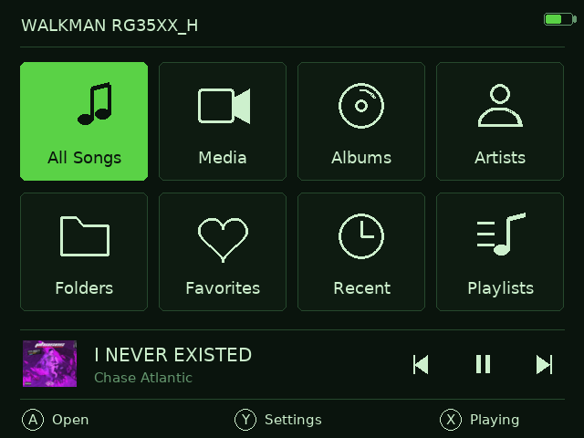
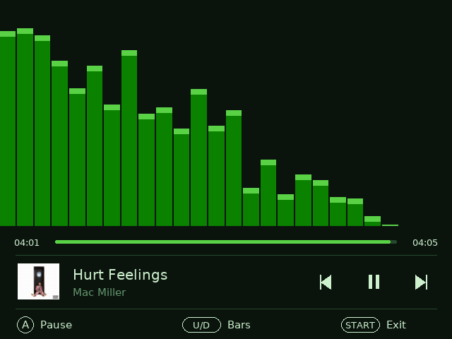
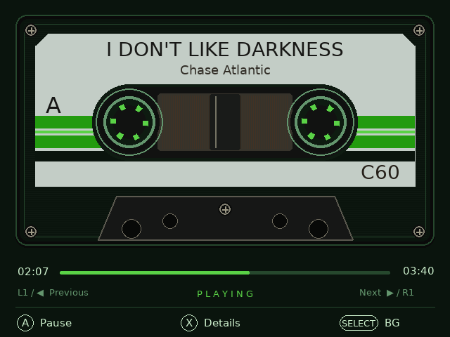

# Walkman RG35XX H

Walkman is a local music and media app for the Anbernic RG35XX H running
KNULLI Linux. It uses a controller-first interface designed for the handheld's
640×480 screen and launches from KNULLI's Ports menu through PortMaster.

## Screenshots

These captures were taken directly from an RG35XX H running the current app.

<div align="center">
  
  
  
</div>

## Latest changes — v1.0.8

- Fixed the handheld controls: **SELECT** now closes the Walkman screen while
  music keeps playing, and **START** fully exits Walkman and stops playback.
- Added the optional **Dynamic visualizer** setting. It uses a brighter,
  stable blend of the current cover-art colors across both the visualizer and
  Now Playing progress bars; grayscale artwork uses the selected theme color.
- Fixed crashes from indexed-color PNG and GIF thumbnails in media and album
  lists. Those files now use a compatible scaler automatically.
- Fixed incorrect controller mappings that could make SELECT behave like an
  exit or leave START unresponsive.

- Search **All Songs**, **Media**, **Albums**, and **Artists**: press **R2**
  to open the keyboard, then **L2** to run the search.
- Albums and Artists now use larger thumbnails. Artist photos can be fetched
  from **Settings → Fetch artist photos...** and are kept on the device.
- The final home card is now **Settings**. Folder browsing lives in
  **Settings → Browse music folders**.

## What the app does

### Music playback

- Plays MP3, FLAC, OGG, WAV, and M4A files through mpv.
- Browses All Songs, Albums, Artists, Favorites, Recent, and Playlists
  (`.m3u` and `.m3u8`), with folder browsing in Settings.
- Maintains a queue with shuffle, repeat, previous, next, and automatic advance.
- Shows the current queue position in Now Playing, such as `3 / 15`.
- Starts a new queue at the song you choose, so it begins as `1 / total`.
- Displays embedded or folder artwork and caches it locally.
- Keeps the now-playing time and progress bar updated from mpv's playback
  position, including recovery after a temporary IPC connection failure.
- Supports background playback when leaving the app with SELECT.

### Media playback

The **Media** library combines videos and pictures found in the `video` folder.
It displays thumbnails in the list and supports common formats when the
device's mpv and ffmpeg builds support them:

- Video: MP4, MKV, AVI, MOV, WebM, M4V, MPEG, and MPG.
- Pictures: JPG, JPEG, PNG, GIF, BMP, and WebP.

Video playback gives mpv exclusive display and controller ownership. The music
visualizer and music controls are not rendered underneath the video. B exits
the current video and returns to the library view.

### Visualizer and artwork processing

- Four visualizer styles: Bars, Mirror, Wave, and Radial.
- Optional Dynamic visualizer color samples a stable, brighter palette from
  the current album art and blends it from the low bars to the high bars.
  Mostly grayscale artwork falls back to the active theme color.
- Visualizer analysis runs in the background so the interface stays usable.
- Settings can process the complete music library and show the current file,
  item count, and progress bar.
- Album art can be extracted from tags or folder images.
- Use **Fetch cover art** in Settings to find missing album covers through
  MusicBrainz and the Cover Art Archive.
- Use **Fetch artist photos** in Settings to add artist thumbnails from
  TheAudioDB. Once saved, they are shown from Walkman's local cache.

### Settings and storage

Settings is a fullscreen interface opened with **Y** from the Library. It
contains playback options, themes, accent color, library rescanning, artwork
tools, visualizer processing, independent cache controls, and storage totals
for the music library, media library, cache, and all Walkman data.

Walkman intentionally uses JSON files rather than SQLite or another database.
This keeps the app self-contained and avoids relying on additional libraries
being installed on the handheld.

### Library sections

- **All Songs** lists every audio track in the music folder.
- **Media** lists every supported video and picture in the video folder and
  shows its generated thumbnail.
- **Albums** and **Artists** group music using cached tag information.
- **Browse music folders** in Settings follows the music folder structure.
- **Favorites** stores tracks you mark for quick access.
- **Recent** shows recently played tracks.
- **Playlists** reads local `.m3u` and `.m3u8` files.

The Library also provides the current mini-player, the Y-button Settings
shortcut, and access to the Now Playing and details screens. Audio playback
keeps running while browsing, and the player can recover its progress display
if mpv's local control connection briefly drops.

## Device requirements

- Anbernic RG35XX H.
- KNULLI Linux installed and working on the device.
- PortMaster installed. Use KNULLI's PortMaster installer if it is not already
  present.
- A system Python 3 with pygame, as provided by the KNULLI/PortMaster setup.
- mpv for audio and video playback.
- ffmpeg for artwork extraction, thumbnails, and visualizer analysis.
- mutagen is optional; it improves metadata scanning when installed.
- Network access is optional and is only needed when fetching cover art or
  artist photos.

## Installation from a release ZIP

1. Download `walkman-rg35xxh.zip` from the repository's Releases page.
2. Extract the ZIP on a computer. It contains a folder named `walkman` with
   `Walkman.sh`, the Python player, artwork, and the empty media folders.
3. Insert the KNULLI SD card into the computer.
4. Open the card's `roms/ports/` directory.
5. Copy the complete `walkman` folder into `roms/ports/`. The launcher file
   must end up at `roms/ports/walkman/Walkman.sh`; do not copy a second
   `Walkman.sh` into the top level of `roms/ports/`.
6. Update the Ports game list as described below so Walkman appears in KNULLI.
7. Safely eject the card and return it to the RG35XX H.
8. Open the KNULLI Ports menu and launch **Walkman**.
9. Copy audio files to `roms/ports/walkman/music/` and videos or pictures to
   `roms/ports/walkman/video/`.
10. Relaunch Walkman, then open **All Songs** or **Media**. The first scan may
   take a little time while metadata and thumbnails are prepared.

For an update, close Walkman and copy the new release's `walkman` folder over
the existing one. Keep the `music`, `video`, `state.json`, and `.cache`
contents; they contain your local library and preferences.

## After adding music or media

Walkman does not need to be reinstalled when you add files. Use this workflow:

1. Copy new audio into `roms/ports/walkman/music/`, or copy videos and
   pictures into `roms/ports/walkman/video/`.
2. Launch Walkman and stay on the Library screen.
3. Press **Y** to open the fullscreen **Settings** screen.
4. Select **Rescan music** and press **A**. This refreshes both the music and
   Media libraries and updates the JSON metadata cache.
5. Return with **B**, then open **All Songs** or **Media** to confirm the new
   files are listed.

New media thumbnails are generated in the background when the Media list is
opened. For music artwork, use **Settings → Fetch cover art...** and choose
**Missing only**. To add artist pictures, use **Settings → Fetch artist
photos...**. To prepare every visualizer file before playback, choose
**Settings → Build visualizer cache**. The current filename and progress bar
are shown while processing; press **B** to cancel.

If a file was renamed, moved, or removed, run **Rescan music** again. If old
artwork remains after a change, clear the cover-art cache from Settings and
open the affected library again.

## Manual installation from source

1. Install PortMaster on KNULLI.
2. Clone or download this repository on a computer.
3. Copy the repository files into a folder named `walkman` on the SD card at
   `roms/ports/walkman/`.
4. Make sure `Walkman.sh` remains in that folder and is executable if your
   extraction tool does not preserve file permissions.
5. Add music to `music/` and other media to `video/`.
6. Launch `Walkman.sh` from the KNULLI Ports menu.

The included `gameinfo.xml` provides display metadata for the PortMaster/KNULLI
launcher.
`Walkman.sh` creates the launcher thumbnail entry when an existing Walkman
game-list entry is present.

## Add Walkman to the KNULLI game list

If KNULLI does not add the app automatically, edit the SD card's
`roms/ports/gamelist.xml` and add this entry inside `<gameList>`:

```xml
<game>
  <path>./walkman/Walkman.sh</path>
  <name>Walkman</name>
  <desc>A cassette-style music and media player for the RG35XX H.</desc>
  <genre>Media</genre>
  <image>./walkman/cover.png</image>
</game>
```

Save the file, safely eject the card, and restart or refresh the KNULLI Ports
menu. If Walkman is already listed, edit that existing entry instead of
adding another one. Keep only the nested path `./walkman/Walkman.sh`; a second
entry such as `./Walkman.sh` creates duplicate Walkman items.

When installing from the GitHub source ZIP rather than the release asset,
create `roms/ports/walkman/` yourself and copy the repository's `Walkman.sh`,
`player.py`, `design.py`, assets, `music/`, and `video/` contents into it before
updating `gamelist.xml`.

## Controls

### Library and player

| Button | Action |
|---|---|
| **A** | Open, play, pause, or confirm |
| **B** | Back or cancel |
| **X** | Toggle Now Playing and details |
| **Y** | Open fullscreen Settings from the Library |
| **Up / Down** | Move through lists; change visualizer style or accent hue |
| **Left / Right** | Previous or next track on player screens |
| **R1** | Lock the screen while audio continues |
| **Hold R1** | Unlock the screen; release it before starting the unlock hold |
| **L1** | Pause or resume audio |
| **R2** | Open search in All Songs, Media, Albums, or Artists |
| **L2** | Run the current search |
| **START** | Exit the app |
| **SELECT** | Exit while keeping audio playing in the background |
| **Volume buttons** | Change device volume, including while locked |

### Video

While a video is open, mpv owns the display and the controller. **B** exits the
video and returns to the originating Media or library screen. The music
visualizer and normal music transport controls are suspended during video
playback.

## Folders and generated data

The installed folder has this layout:

```text
walkman/
├── Walkman.sh
├── player.py
├── design.py
├── gameinfo.xml
├── cover.png
├── font.ttf
├── font-LICENSE.txt
├── music/
├── video/
├── state.json                 # created on first run
└── .cache/                    # created on first run
    ├── metadata/metadata.json
    ├── covers/*.png
    └── visualizer/*.viz
```

`music/` and `video/` are intentionally empty in the release package. Add
your own files; personal media is never included in source or release assets.

The cache is organized by function:

- `metadata/metadata.json` stores tags and file information.
- `covers/` stores extracted or downloaded artwork and media thumbnails.
- `visualizer/` stores precomputed visualizer data for faster playback.

Settings can clear each cache type independently. The visualizer builder can
be cancelled with **B** and will continue from valid cache files on a later
run.

## Troubleshooting

- **Walkman does not appear:** confirm the folder is exactly
  `roms/ports/walkman/` and relaunch the Ports menu.
- **No music or media appears:** check that files are in `music/` or `video/`,
  use a supported extension, and rescan from Settings.
- **A video will not play:** try an H.264/AAC MP4 or a smaller resolution.
  Playback depends on the mpv codecs and hardware acceleration available in
  the KNULLI image.
- **Video stutters:** use a lower-resolution file, close other ports, and try
  again after restarting Walkman. Hardware decoding and frame-drop are enabled
  for the RG35XX H, but some codecs remain too demanding for the device.
- **Artwork or thumbnails are missing:** allow background processing to finish,
  confirm ffmpeg is available, and use Settings to clear and rebuild covers.
- **Visualizer data is missing:** open Settings and run the full visualizer
  processor. The current file and progress are shown while it works.
- **Progress stops updating:** return to the library and reopen the track. The
  player periodically re-reads time and duration from mpv and reconnects its
  local IPC socket when needed.
- **Controls seem stuck after a video:** press B once, wait for the library to
  return, and avoid pressing transport controls during the transition.
- **Screen lock:** R1 locks only while audio is playing. Release R1, then hold
  it again to unlock. START exits the app and does not control the lock.

## Privacy and security

Walkman is a local player. It does not require an account or transmit library
data. Optional artwork fetching sends artist/album search terms to MusicBrainz
and artist names to TheAudioDB. Local state, metadata, artwork,
visualizer data, logs, and personal media are excluded from Git and release
packages.

## License and attribution

Walkman is distributed under the [MIT License](LICENSE). The bundled DejaVu
Sans font is distributed under its own license in
[`font-LICENSE.txt`](font-LICENSE.txt); retain that file when redistributing
the app.

Walkman is an independent community project and is not affiliated with
Anbernic, KNULLI, PortMaster, or mpv.
